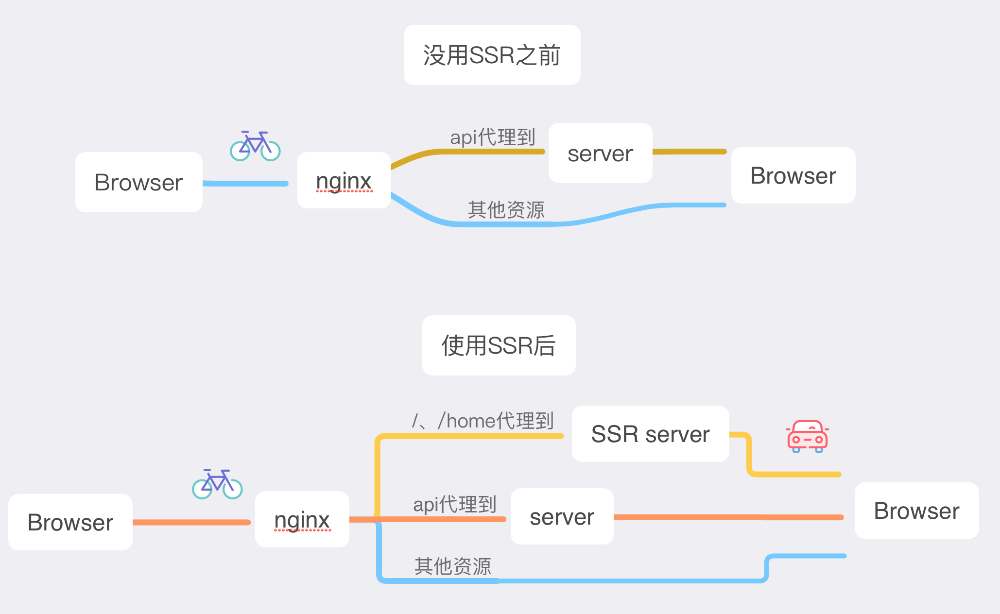
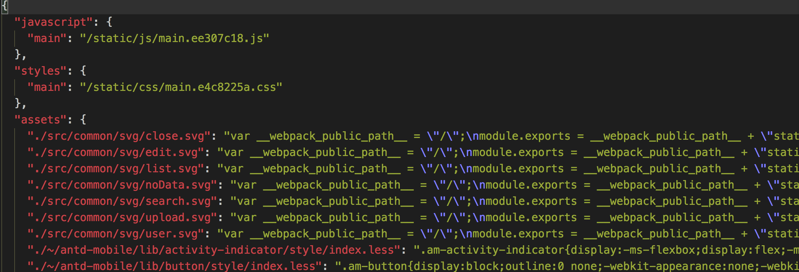

branch

- [redux-redux-saga](https://github.com/xiyuyizhi/movies/tree/redux-redux-saga) 加入 redux 和 redux-saga

- [master](https://github.com/xiyuyizhi/movies/tree/master)

## 此分支加入服务端渲染


> 之前react做的一个应用，最近把首页改成了服务端渲染的形式，过程还是很周折的，踩到了不少坑，记录一些重点，希望有所帮助

## 前端使用的技术栈

- react、react-dom 升级到 v16

- react-router-dom v4 

- redux red-sage

- antd-mobile 升级到 v2

- ssr服务 express

[项目地址](https://github.com/xiyuyizhi/movies), 喜欢的给个star，感谢。。。。。。。

### 访问地址(手机模式)


### [非服务端渲染](http://movies.xiyuyizhi.xyz:8080/home)  [服务端渲染](http://ssr.xiyuyizhi.xyz:8080)


### 效果对比

 


### 前后处理流程对比



## react下ssr的实现方式

React下同构的解决方案有next.js、react-server等，这里，因为这个项目之前已经采用create-react-app、redux做完了，只是想在现有系统基础上把**首页改成服务端直出的方式**，就选择了[webpack-isomorphic-tools](https://github.com/catamphetamine/webpack-isomorphic-tools)这个模块

## webpack-isomorphic-tools介绍

如果我们想在现有React系统中引入同构，首先要解决的一个重要问题是:**代码中我们import了图片,svg,css等非js资源，在客户端webpack的各种loader帮我们处理了这些资源，在node环境中单纯的依靠babel-regisiter是不行的，执行renderToString(<App />)会报错，非js资源没法处理**

而webpack-isomorphic-tools就帮助我们处理了这些非js资源，在客户端webpack构建过程中，webpack-isomorphic-tools作为一个插件，生成了一份json文件，形如：



有了这份映射文件，在同构的服务端，renderToString(<App />)执行的过程中，就可以正确的处理那些非js资源

比如我们有一个组件：

```
const App =()=>{
    return 
}

同构的服务端调用renderToString(<App />)，就生成正确的

标签

```

对webpack-isomorphic-tools的具体使用参见[github](https://github.com/catamphetamine/webpack-isomorphic-tools)

## 实现ssr需要解决的问题

1. 非js资源引用的处理，上面已经说过

2. 初始redux store数据的获取(即保证请求的服务端渲染的页面和单纯请求的首页的状态一致)

3. 路由跳转如何处理

4. 用户在客户端登录了，重新请求服务端页面，服务端如何加入用户已登录了的新状态

5. 用户访问了服务端渲染的首页，客户端js加载完后还是会执行，组件componentDidMount()中的ajax请求如何避免触发

额，一一个说

### 初始redux store数据的获取

简单总结就是

1. 我们请求了ssr服务，服务在给我们吐页面之前，实例化一个createStore()对象，要将原本在客户端初始请求的那几个ajax在这发，这几个请求完成后都dispatch(action),然后store中就有初始状态了

2. 然后执行

```
renderToString(<Provider store={store}>
        <Router location={req.baseUrl}
            context={context}>
            <Routes />
        </Router>
    </Provider>)
 //得到填满数据的标签  

```

3. 拼接html

注意，上面说的webpack-isomorphic-tools中生成的json文件中有js,css的对应关系，这里我访问那个json文件得到js、css的路径，拼到html中

还要返回store中保存的状态，供客户端js createStore使用

```
<script>
        window.__INITIAL_STATE__ = ${JSON.stringify(store.getState())}
    </script>
```

4. 在客户端js中

```
const sagaMiddleware = createSagaMiddleware()
const store = createStore(
    reducer,
    window.__INITIAL_STATE__,
    applyMiddleware(sagaMiddleware)
)
sagaMiddleware.run(rootSaga)

``` 


### 路由

在做同构的时候不能用BrowserRouter，要使用无状态的StaticRouter，并结合location和context两个属性

有这样的路由结构

```
<div className="main">
    <Route exact path="/" render={() =>
        <Redirect to="/home"></Redirect>
    }></Route>
    <Route path="/home" component={Home}></Route>
    <Route path="/detail/:id" component={Detail}></Route>
    <Route path="/user" component={User}></Route>
    <Route path="/reptile" component={Reptile}></Route>
    <Route path="/collect" component={Collect}></Route>
</div>
//默认跳到/home,其他的该到哪到哪
```

server端的代码要这样

```
const context = {}
const html = renderToString(
    <Provider store={store}>
        <Router location={req.baseUrl}
            context={context}>
            <Routes />
        </Router>
    </Provider>)
//<Route>中访问/,重定向到/home路由时
if (context.url) {
    res.redirect('/home')
    return
}
```
**StaticRouter可以根据request来的url来指定渲染哪个组件,context.url指定重定向到的那个路由**

也就是说，要是访问 /,StaticRouter会给我们重定向到/home，并且StaticRouter自动给context对象加了url,context.url就是重定向的/home，当不是重定向时，context.url是undefined

我们还可以自己写逻辑 通过context来处理302、404等。但这里我不需要。。。。。，为什么呢？

**我没做全栈的同构，只服务端渲染了主页，渲染一个和多个差不多，全都渲染的话就是在服务端要根据当前请求的路由来决定要发那些请求来填充Store**

我对路由的处理流程上面的思维导图有说明，就是在nginx中多配一个代理。

`对于访问/、/home这两个路由，代理到ssr服务，来吐首页内容,api代理到后端服务,其他的直接返回(也就是说如果在detail页面或user页面刷新了页面还是之前客户端渲染那套)`


### 对登录操作的处理

上面说server端初始化数据的时候还有一个登陆问题没说。

`用户初始访问了服务端渲染的首页，然后在客户端转到登录页面登陆了,重新回到首页刷新了页面，喔，又去请求了ssr服务，但服务端不知道当前用户登录了啊，还是原来的流程，返回的__INITIAL_STATE__中还是没有用户的个人信息和已登录状态`

所以，在客户端登陆后，要将用户的token存到cookie中，这样，**在首页就算用户刷新了页面，重新请求页面请求中也会带上cookie，在服务端，根据request.cookies中是否有token来决定发哪些请求填充store**

```
if (auth) {
    //要是有token就去查用户信息和是否登录状态(还查是否登录是因为token有可能是被篡改过的)
        promises = [
            getMoviesList(store, auth),
            getCategory(store),
            checkLogin(store, auth),
            getUinfo(store, auth)
        ]
    } else {
        promises = [
            getMoviesList(store),
            getCategory(store),
        ]
}
Promise.all(promises).then(x=>{
    renderToString(<Provider store={store}></Provider>)
})

```

### 避免客户端js中初始请求的触发

到这一步，访问域名，就能够正确展示服务端渲染的页面，跳到别的路由，客户端的js也能正常处理接下来的事，但是,服务端渲染页面展示后，首页那几个ajax请求还是触发了，这是没必要的。

原以为这是react renderToString()生成的标签和客户端js hydrate()的有差异导致的，然而，实际上，js执行了，组件的生命周期该触发还是会触发的,不只是` attach event listeners to the existing markup`

所以要手动避免

```
在App组件中

componentDidMount() {
        if (!window.__INITIAL_STATE__) {
            this.props.checkLogin()
            this.props.loadCategory()
        }
    }

//当当前页面是服务端返回的(因为window.__INITIAL_STATE__有初始状态)，初始的ajax就不触发了

```

### 总结

服务端渲染的坑还是挺多的，这一个星期就搞它了。。。。这里记录一些比较重要的东西，[具体细节有兴趣的可以看下代码](https://github.com/xiyuyizhi/movies).最后，最重要的，喜欢的给个star，感谢。。。。。。。