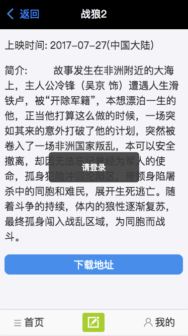
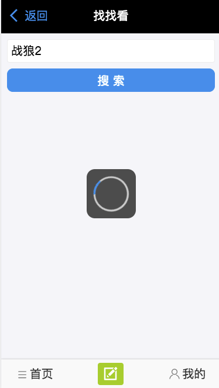
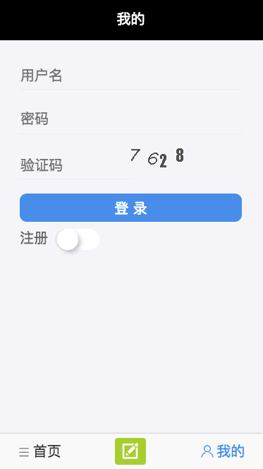
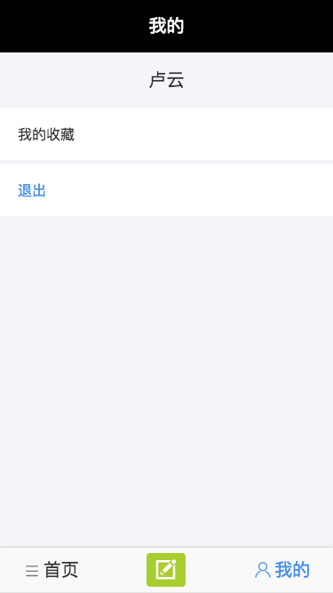

# 一步一步搭建react应用-开篇

*断断续续利用周末时间做了两个月，基于react和express的一个小项目差不多做完了。做之前想着边做边做些笔记，记录下每步遇到的问题和解决方案,然而没有。*

* 所以现在开始补一下。*

* 初衷是练习一下react相关的技术栈，但做的过程感觉对后端投入的热情更大。*

## 接下来会从这几点写写文章记录下

- [一步一步搭建react应用-前后端初始化](/dayByday/day1.md)

- [爬取豆瓣电影的电影信息](/dayByday/day2.md)

- [mongodb开启身份认证](/dayByday/day3.md)

- [使用 jwt + redis 来做基于token的用户身份认证](/dayByday/day4.md)

- node中使用 mocha + supertest + should 来写单元测试

- 部署

## 技术栈

- react + react-router + antd-mobile + fetch
- redux(没用,之后改)
- express + mongodb + redis


## 运行

clone代码到本地

前端:
```
    npm install
    npm start

```

后端:
```
    1. 需要安装mogondb 本项目mogondb端口 3307,并开启权限认证。可以在/BE/config/db.js中修改

    2. 需要安装redis  brew install redis

    3. npm install -g pm2

    3. node 版本最好最新版本，因为使用了 async await,推荐nvm来管理node版本

    4. npm install 

    5. npm run test 运行单元测试

    6. npm start


```


## 功能介绍

之前看了挺多棒子电影的，所以想做一个电影相关的小项目，主要功能：

- 首页 电影列表展示，可搜索和分类筛选

- 电影详情页(有无下载地址)

- 爬取豆瓣电影并录入

- 登录、注册

- 管理员增删改查

- 普通登录用户收藏电影

- 我的收藏列表


---

### 首页


### 详情页


## 录入



## 用户



